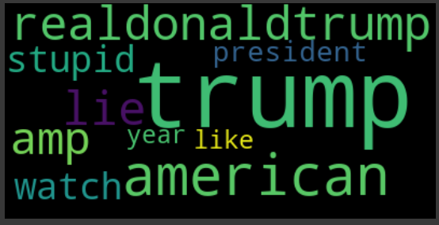
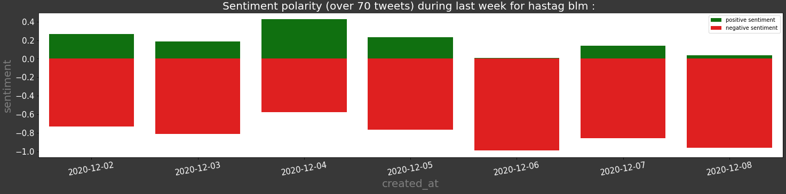

# twitter-analysis-api
A REST API to get some insights about what's happening on twitter

#NLP #HuggingFace #Transformers #Flask #TwitterApiV2 #gensim #nltk

This API is a simple FLASK API to get tweets from twitter api v2 and compute some insights from those tweets. As of now, this API can:
- Query tweets from twitter
- Compute tweets sentiment (POSITIVE or NEGATIVE) with a tensorflow sentiment model (from HuggingFace transformers library)
- Compute and retrieve main topics from requested tweets 

This is thus a simple API and you can add as many features as you want. Feel free to contact me or send a pull request to the project.

## Sentiment and Topics analysis
Sentiment analysis is done following steps below :
- Fetch tweets from Twitter API v2 according to a predefined Hashtag.
- Clean those tweets by removing symbols like #,@,...
- Download or load a pretrained model from HugginFace transformers library to compute sentiment.

Topics analysis is done following steps below:
- Get a corpus of texts from downloaded tweets
- clean those tweets as in sentiment analysis + lemmatization
- Create a dictionary from that corpus 
- Train a LDA model to reveal topics

Below are some vizualisations of the results (from vizualisation_app.ipynb) you can get from the Flask API. The 1st figure is the sentiment polarity for tweets containing the input hashtag over the last week. The 2nd figure is a wordcloud representing the main topics extracted from tweets.
### #Christmas

### #trump

### #blm

### #covid19

## FLASK API paramters
Here is a list of paramters you can use to query the API
- hashtag : the hastag you want to analyse (examples : trump, blm, covid,..)
- nb_days : The number of days before current day from which you want to request tweets
- nb_tweets : The total nulber of tweets you want to request for your analysis (the more the better)
- get_topic_words : If True, the topics will be retrieved from your tweets
- n_topics : The number of topics you want to extract
- n_words_per_topic : The number of words per topic you want to have.
- lda_passes : Number of passes for LDA model (a value between 2 and 5 is ok)
- return_tweets : If true, the list of tweets will be returned along with the sentiment.
- language : language of your requested tweets. Current default value is "en" for english. If you want to analyse another language, you need to add a sentiment model supporting your language.

## Run the Code

### Requirements
- python 3 
- searchtweets-v2 (twitter api python library)
- transformers (huggingface library for transformers)
- Pandas
- Matplotlib
- Seaborn
- wordcloud
- gensim
- nltk
- tensorflow

### Steps
- Create a developer account for twitter api access (https://developer.twitter.com/en/apply-for-access) and add your BEARER TOKEN in twitter_keys.yaml file.
- Launch the FLASK server by setting FLASK_APP environment variable to "flask_server.py" and then execute "flask run". (Fore more details see the official documentation here https://flask.palletsprojects.com/en/1.1.x/quickstart/)
- Then you can query the API from your own application. vizualisation.ipynb is a starter notebook for this purpose.

## Improve the API
There are many ways this basic API can be improve to get better results:
- Using only the hastag to query tweets is not enough. There are many other ways to accurately fetch tweets. For example you can add keywords, location and so on. See Twitter API official doc.
- Use a better sentiment model. As example here, we are using a huggingface transformer named "distilbert-base-uncased-finetuned-sst-2-english". It has been finetuned on SST2 dataset (movies reviews) so it is not accurate for tweets. You can finetune your own model using for example this dataset for tweets sentiment analysis: https://www.kaggle.com/kazanova/sentiment140
- Improve topic modelling method. LDA model is a good way to do it but there are many other ways for this.
- Try different tweets cleaning processes. In fact tweets are very noisy and thus this step is quite critical.
- Always remember that there is a biais in sentiment polarity provided by the model you use. In fact the biais comes from the dataset the model has been trained on and thus you should not consider those sentiments as perfectly accurate.
